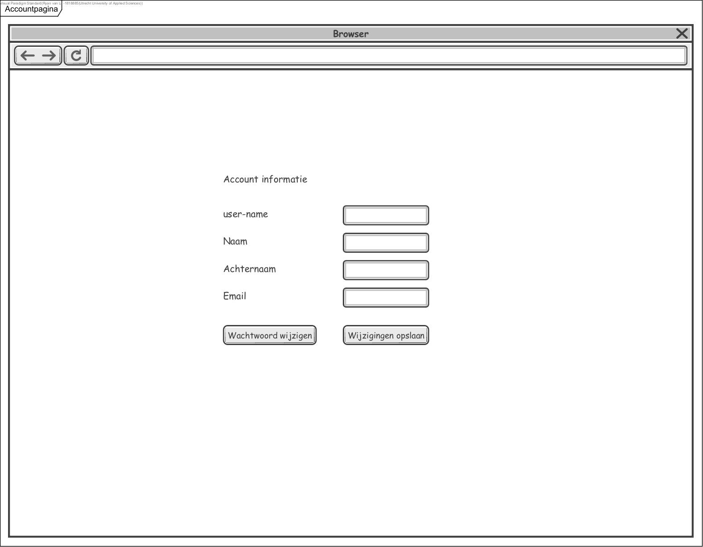
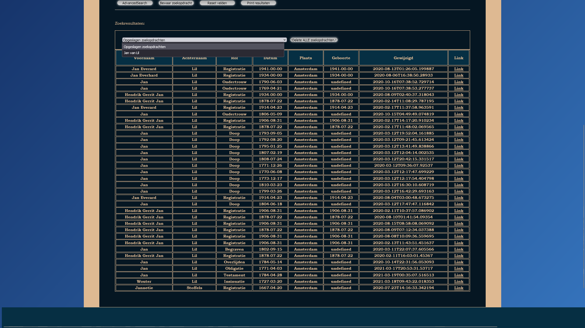

# Ontwerp

# ArchiveTrawler

| Datum | : | 12-05-2022 |

| AuteurStudent # | :: | Ryan L.J. van Lil 1818885
 |
 |
 |

#### Revisiehistorie

Dit is een klein overzicht van aanpassingen aan het document Ontwerp.md

| Datum | Versie | Omschrijving                                                 |
|-------|-------|--------------------------------------------------------------|
| 27-05 | 1.0   | Eerste Ontwerp, alles ingevuld en opgeschreven.              |
| 30-05 | 1.1   | UnitTesting                                                  |
| 31-05 | 1.2   | Project bijgeschaafd kleine verbeteringen ook in Design      |
| 03-06 | 1.2   | Class diagram bijgewerkt                                     |
| 09-06 | 1.3   | Document verfijnd, veel text veranderd/                      |  
| 19-06 | 1.4    | updated single use case from of to single use case           |  
| 20-06 | 1.5   | Design geupdate                                              |  
| 23-07 | 1.6   | Veel onderzoek vanaf dit moment naar data scraping externe sites | 
| 04-07 | 2.0   | Final versie                                                 |  

Voor een gedetailleer overzicht van de revisiehistorie zal ik dan toch verwijzen naar de Git.

## Inhoudsopgave

| nr.  | Naam                                          |
|------|-----------------------------------------------|
 | 1    | [Inleiding](#1-inleiding)                     |
 | 1.01 | [Leeswijzer](#1.2-leeswijzer)                 |
 | 1.1  | [Doelgroep (lezersgroep)](#1.1-doelgroep)     |
 | 1.2  | [Toegankelijkheid](#1.2-toegankelijkheid)     |
| 2    | [Overzicht         ](#2-overzicht)            |
| 3    | [Uses cases        ](#3-use-cases)            |
| 3.1  | [Actoren           ](#3.1-actoren)            |
| 3.2  | [Use case templates](#3.2-use-case-templates) |
| 3.3  | [Wireframes        ](#3.3-wireframes)         |
| 4    | [Domeinmodel       ](#4-domeinmodel)          |
| 5    | [Technologieën     ](#5-technologieën)        |
| 6    | [Overdracht        ](#6-overdracht)           |
| 7    | [Referenties       ](#7-referenties)          | 

## 1 Inleiding

#### 1.01 Leeswijzer
Dit document omvat het hele ontwerp en het ontwerp proces, 
het zal hier zo beknopt doch gedetailleerd mogelijk getoond worden.
Via de inhoudsopgave boven kan je direct naar de juiste informatie gaan.
Ook zal dit automatisch links creeeren die dan gedeeld/opgeslagen kunnen worden.
Neem hier op hoe het ontwerp tot stand gekomen is alsmede voor wie het bedoeld is met eventueel een lezersadvies.

### 1.1 Doelgroep

Het type klant dat ik probeer te bereiken:

##### Psychografie

- Wil graag van bepaalde historische mensen informatie vinden.
- Wil graag in bepaalde archieven zoeken.
- Vindt het belangrijk dat ze niet dubbel werk verrichten.

##### Uitdagingen
- Het vinden van nieuwe data die betrekking heeft tot hun onderzoek.
- Het overzicht behouden met al bekeken data.

##### Voorkeurskanalen
- Websites of webapps. 
- Ze zullen graag op een desktop werken, vanwege de betrouwbaarheid en gemakken, bijvoorbeeld printers en scanners._
- E-mail notificaties.
- Een desktopversie.

### 1.2 Toegankelijkheid

Uiteraard wil ik een product hebben dat toegankelijk is. Vandaar ik rekening heb gehouden met slechtzienden en zelfs blinde mensen.
- Dit heb ik gedaan door ervoor te zorgen dat ik hoog genoeg contrast heb, groot genoege letters, en duidelijke simpele vormen.
- Ook heb ik ervoor gekozen tekst kort en bondig te houden, om de informatievoorziening concreet te houden.
- Een ander belangrijk element is het feit dat ik aan alles omschrijvende labels heb toegevoegd. 
Dit is voor blinden een must om de app te kunnen navigeren.

Hieronder een paar voorbeelden van testcases door middel van Wave:

## 2 Overzicht

Het systeem heeft een gebruikersomgeving waar je kan inloggen, registreren en uitloggen. 

Het systeem neemt zoektermen aan, 
deze zet hij vervolgens om in queries naar meerdere websites. 
De opgeleverde links worden vervolgens getoond.

Per gebruiker worden de links geregistreerd als onbekeken. 
Tot deze worden geopend, dan logt het systeem wanneer en hoe vaak deze bekeken zijn.
Dit is voor de gebruiker ook zichtbaar.

De zoektermen kunnen ook opgeslagen worden in een herhalende zoekopdracht. 
Het systeem voert opgeslagen zoekopdrachten met regelmaat uit (1x per week), 
en notificeert de gebruiker als er nieuwe links gevonden worden.

De gebruiker kan in zijn eigen omgeving ook zijn gegevens wijzigen. En zijn zoekopdrachten inzien.

## 3 Use cases

De use case diagram is redelijk uitvoerig. 
Per use case zijn er sub use-cases vermeldt, dit ter verdieping.

De user is feitelijk de enige gebruiker van het systeem.
Verder kan de developer ook nieuwe websites op af te speuren toevoegen, 
dit is heir gerepresenteerd omdat het wel een use case is die uiteindelijk de gebruiker wellicht zelf ook wil kunnen.

### 3.1 Actoren

##### User: 

De user is in dit geval de eindgebruiker. Dat zou de klant kunnen zijn, of andere eventuele klanten in de toekomst. 
De user is in zijn eigen omgeving oppermachtig, en grenst daarin niet aan andere users. 
Mag alles wijzigen en alle use cases uitvoeren, behalve een website toevoegen. 

##### Developer:

De developer is in dit geval het programmeer team, en heel specifiek ben ik dat persoonlijk Ryan. 
Deze voert alleen een use case uit die eigenlijk buiten de scope van dit project valt.

### 3.2 Use Case Templates

Hieronder volgen per use case een paragraaf met de template beschrijving e.d. zoals geleerd bij Modelling.
Ik heb er een emoji bijgezet om aan te geven of dit,
*niet* werkend = 👎,  deels geimplementeerd = 👌 of *volledig* = 👍 werkend is op moment van schrijven

| nr.  | Naam                                                      |
|------|-----------------------------------------------------------|
 | 1    | [Inleiding](#1-inleiding)                                 |
 | 1.1 | [Doelgroep (lezersgroep)](#1.1-doelgroep) |
 | 1.2 | [Leeswijzer](#1.2-leeswijzer)                           |

 

####  ID 0.1   Naam Zoekopdracht starten op meerdere sites. 
| Actoren              | User                                                                                                                                                         |
|----------------------|--------------------------------------------------------------------------------------------------------------------------------------------------------------|
| Samenvatting         | Proof of concept: Zoekopdracht starten op externe website,  en deze geladen openen.                                                                  |
| Precondities         | actor heeft de site open, vult een zoekterm in en klikt op ok.                                                                                               |
| Stappenplan/scenario | 1. De actor vult zoektermen in de invoervakken, 2. klikt op zoek 3. Het systeem opent meerdere tabs met de ingevulde zoektermen op aparte databases. |
| Postcondities        | De actor kan nu navigeren naar de nieuw geopende tabs.     👍                                                                                                |
| Frameworks           | JAX-RS                                                                                                                                                            |
 

#### ID 1.0  Inloggen.
| Actoren              | User                                                                                                                                                                                                                             |
|----------------------|----------------------------------------------------------------------------------------------------------------------------------------------------------------------------------------------------------------------------------|
| Samenvatting         | Het inloggen als gebruiker in zijn eigen omgeving.                                                                                                                                                                               |
| Precondities         | Er is een database met alle gebruikers, en de actor heeft hier een account in.                                                                                                                                                   |
| Stappenplan/scenario | 1. De actor vult zijn inloggegevens in, en klikt op inloggen.  2. Het systeem verifiert of deze overeenkomen met een actor. 3. Als dit lukt is de actor nu ingelogd. 3b. Zo niet, dan toont het systeem een melding. |
| Postcondities        | De actor is nu ingelogd in zijn eigen omgeving. Of De actor kan het nogmaals proberen/een nieuw account aanmaken.    👍                                                                                                  |
| Frameworks           | JAX-RS , JSONWEBTOKEN                                                                                                                                                                                                            |

 

#### ID 1.1  Nieuwe gebruiker aanmaken.
| Actoren              | User                                                                                                                                                                                                                                                                                  |
|----------------------|---------------------------------------------------------------------------------------------------------------------------------------------------------------------------------------------------------------------------------------------------------------------------------------|
| Samenvatting         | Nieuw gebruikersaccount aanmaken.                                                                                                                                                                                                                                                     |
| Precondities         | De actor is nog niet ingelogd. En kijkt naar de inlogpagina.                                                                                                                                                                                                                          |
| Stappenplan/scenario | 1. De actor klikt op de link: <Nieuwe gebruiker aanmaken> 2. Vervolgens vult deze de gevraagde gegevens in. 4. Het systeem verifieert of er nog geen actor is met die gegevens. 5. Als dit alles lukt is er een nieuw account aangemaakt, en krijgt de actor bevestiging. |
| Postcondities        | De actor heeft nu een account aangemaakt, of deze bestond al en wordt doorverwezen naar wachtwoord resetten: Use case 1.2  👍                                                                                                                                                         |
| Frameworks           | JAX-RS                                                                                                                                                                                                                                                                                |

 

#### ID 1.2  Wachtwoord wijzigen.
| Actoren              | User                                                                                                                                                                         |
|----------------------|------------------------------------------------------------------------------------------------------------------------------------------------------------------------------|
| Samenvatting         | Wachtwoord van een bestaand account wijzigen.                                                                                                                                |
| Precondities         | De actor heeft een account en is op de wachtwoord wijzig pagina.                                                                                                             |
| Stappenplan/scenario | 1. De actor vult de benodigde accountgegevens in 2. het systeem controleert dit en geeft vervolgens als de info klopt: Een email met mogelijkheden tot wachtwoord reset. |
| Postcondities        | De actor heeft zijn wachtwoord gewijzigd en kan nu in het vervolg hiermee inloggen.  👍                                                                                      |
| Frameworks           | JAX-RS , JSONWEBTOKEN                                                                                                                                                                                                            |

 

#### ID 1.3  Persoonlijke informatie wijzigen.
| Actoren              | User                                                                                                                                                |
|----------------------|-----------------------------------------------------------------------------------------------------------------------------------------------------|
| Samenvatting         | Accountinformatie wijzigen. (behalve het wachtwoord)                                                                                                |
| Precondities         | De actor is ingelogd en kijkt naar de Accountinformatie wijzigen pagina.                                                                            |
| Stappenplan/scenario | 1. De actor vult de benodigde informatie in 2. klikt op opslaan. 3. Het systeem wijzigt de bestaande gegevens en geeft hiervan een melding. |
| Postcondities        | De gegevens van het account zijn gewijzigd.   👍                                                                                                    |
| Frameworks           | JAX-RS , JSONWEBTOKEN, JSON                                                                                                                                                                      |

 

#### ID 2.0   Zoekopdracht aanmaken.
| Actoren              | User                                                                                                                                                                                          |
|----------------------|-----------------------------------------------------------------------------------------------------------------------------------------------------------------------------------------------|
| Samenvatting         | De hoofdactie van dit systeem.                                                                                                                                                                |
| Precondities         | De actor is ingelogd, en wil iets zoeken.                                                                                                                                                     |
| Stappenplan/scenario | 1. De actor vult de gegevens in die opgezocht moeten worden. 2. En klikt op zoeken. 3. Het systeem neemt deze gegevens aan, 4. maakt hier zoekqueries van, 5. voert deze uit. |
| Postcondities        | De actor kan nu de zoekresultaten laten tonen door het systeem.    👍                                                                                                                         |
| Frameworks           | JAX-RS , JSONWEBTOKEN, JSON                                                                                                                                                                      |

 

#### ID 2.1   Zoekresultaten bekijken.
| Actoren              | User                                                                                                                                                                                                                                                          |
|----------------------|---------------------------------------------------------------------------------------------------------------------------------------------------------------------------------------------------------------------------------------------------------------|
| Samenvatting         | Zoekresultaten bekijken.                                                                                                                                                                                                                                      |
| Precondities         | Er is een zoekopdracht aangemaakt door de gebruiker.                                                                                                                                                                                                          |
| Stappenplan/scenario | 1. De actor kiest een zoekopdracht of heeft deze net aangemaakt.  2. Vervolgens kiest deze om deze te tonen. 3. Het systeem voert de zoekopdracht uit/heeft dit onlangs gedaan en toont de resultaten. 4. De actor kan ze nu zien en doorklikken. |
| Postcondities        | De actor heeft de zoekresultaten gezien, kan doorklikken naar de betreffende links,  en kan ook de resultaten zelf exporteren/opslaan. De zoekopdracht zelf kan nu ook opgeslagen worden.    👍                                                           |
| Frameworks           | JAX-RS , JSONWEBTOKEN, JSON                                                                                                                                                                      |

 

#### ID 2.2   Zoekopdracht opslaan.
| Actoren              | User                                                                                                                                                             |
|----------------------|------------------------------------------------------------------------------------------------------------------------------------------------------------------|
| Samenvatting         | Zoekopdracht opslaan.                                                                                                                                            |
| Precondities         | Er is een zoekopdracht aangemaakt door de actor, de resultaten kunnen ingekeken worden.                                                                          |
| Stappenplan/scenario | 1. De actor kiest er voor om de zoekopdracht op te slaan.  2. Het systeem controleert of deze nog niet opgeslagen staat, en schrijft vervolgens een log bij. |
| Postcondities        | De zoekopdracht is opgeslagen, de actor kan deze van nu af aan op een later moment bekijken en beheren.      👍                                                  |
| Frameworks           | JAX-RS , JSONWEBTOKEN, JSON                                                                                                                                                                      |

 

#### ID 2.2.1   Zoekopdracht herhalen.
| Actoren              | User                                                                                                                                                                                                  |
|----------------------|-------------------------------------------------------------------------------------------------------------------------------------------------------------------------------------------------------|
| Samenvatting         | Een eerder opgeslagen zoekopdracht herhalen.                                                                                                                                                          |
| Precondities         | Er is eerder een zoekopdracht opgeslagen.                                                                                                                                                             |
| Stappenplan/scenario | 1. De actor selecteert een zoekopdracht uit de lijst. 2. Het systeem voert deze uit en toont de resultaten.                                                                                       |
| Postcondities        | De actor kan nu de zoekresultaten aanklikken, maar ook inzien of de links al eerder bekeken zijn en zo ja, hoe vaak.  👌 de logs van de zoekresultaten zijn nog niet geimplementeerd, ze bestaan wel. |
| Frameworks           | JAX-RS , JSONWEBTOKEN, JSON                                                                                                                                                                      |

 

#### ID 2.2.2  Meldingen van nieuwe resultaten ontvangen.
| Actoren              | User                                                                                                                                                                                                                        |
|----------------------|-----------------------------------------------------------------------------------------------------------------------------------------------------------------------------------------------------------------------------|
| Samenvatting         | De gebruiker ontvangt meldingen van nieuwe resultaten op opgeslagen zoekresultaten. Of via de mail of in de gebruikers omgeving.                                                                                            |
| Precondities         | Er zijn zoekopdrachten opgeslagen.                                                                                                                                                                                          |
| Stappenplan/scenario | 1. Met enige regelmaat, stel 1x per dag, voert het systeem alle zoekopdrachten uit. 2. Het systeem controleert of er sinds de vorige keer nieuwe resultaten bij zijn gekomen. 3. Zo ja, dan geeft deze een melding. |
| Postcondities        | De actor weet nu dat er nieuwe resultaten zijn, en kan deze opzoeken via het systeem.   👎   De gebruiker ontvangt geen meldingen, automatisch herhalende zoekopdrachten is nog niet geimplementeerd.                       |
| Frameworks           | JAX-RS , JSONWEBTOKEN, JSON                                                                                                                                                                      |

 

#### ID 2.3  Zoekresultaten opslaan/exporteren.
| Actoren              | User                                                                                                                                     |
|----------------------|------------------------------------------------------------------------------------------------------------------------------------------|
| Samenvatting         | Zoekresultaten die getoond worden kunnen ook geexporteerd worden. Deze worden als een lijst van links in een bestand gedownload.         |
| Precondities         | Er is een zoekopdracht uitgevoerd.                                                                                                       |
| Stappenplan/scenario | 1. De actor kiest om de zoekresultaten op te slaan. 2. Het systeem maakt hier een mooi bestandje van en biedt deze ter download aan. |
| Postcondities        | De actor kan nu op zijn/haar systeem kiezen waar deze op te slaan.    👍                                                                 |
| Frameworks           | JAX-RS , JSONWEBTOKEN, JSON                                                                                                                                                                      |

 

#### ID 2.4  Zoekopdracht wijzigen.
| Actoren              | User                                                                                                                                                                                |
|----------------------|-------------------------------------------------------------------------------------------------------------------------------------------------------------------------------------|
| Samenvatting         | Het algemeen wijzigen van een opgeslagen/net uitgevoerde zoekopdracht.                                                                                                              |
| Precondities         | Er is een zoekopdracht uitgevoerd of opgeslagen                                                                                                                                     |
| Stappenplan/scenario | 1. De actor selecteert de zoekopdracht die gewijzigd moet worden. 2.De benodigde wijzigingen worden ingevoerd. 3. Het systeem vervangt de oude zoekopdracht met een nieuwe. |
| Postcondities        | Er is een nieuwe zoekopdracht, deze kan opgeslagen worden en/of uitgevoerd.   👌 - ze kunnen verwijderd worden, en ook gewijzigde en nogmaals opgeslagen.                           |
| Frameworks           | JAX-RS , JSONWEBTOKEN, JSON                                                                                                                                                                      |

 

#### ID 2.4.1  Filters kiezen.
| Actoren              | User                                                                                                                                                                                |
|----------------------|-------------------------------------------------------------------------------------------------------------------------------------------------------------------------------------|
| Samenvatting         | De gebruiker kan een zoekopdracht definieren dmv bepaalde zoekfilters.                                                                                                              |
| Precondities         | Er is een zoekopdracht opgeslagen of net uitgevoerd in werkgeheugen.                                                                                                                |
| Stappenplan/scenario | 1. De actor selecteert de zoekopdracht die gewijzigd moet worden. 2.De benodigde wijzigingen worden ingevoerd. 3. Het systeem vervangt de oude zoekopdracht met een nieuwe. |
| Postcondities        | Er is een nieuwe zoekopdracht, deze kan opgeslagen worden en/of uitgevoerd.    👌 - zoekfilters zijn beperkt, in de simpelzoeken pagina zijn ze wel een stuk breder.                |
| Frameworks           | JAX-RS , JSONWEBTOKEN, JSON                                                                                                                                                                      |

 

#### ID 2.4.2   Kiezen welke websites.
| Actoren              | User                                                                                                                                                                                |
|----------------------|-------------------------------------------------------------------------------------------------------------------------------------------------------------------------------------|
| Samenvatting         | De gebruiker kan een zoekopdracht definieren dmv keuze welke archief te doorzoeken.                                                                                                 |
| Precondities         | Er is een zoekopdracht opgeslagen of net uitgevoerd in werkgeheugen.                                                                                                                |
| Stappenplan/scenario | 1. De actor selecteert de zoekopdracht die gewijzigd moet worden. 2.De benodigde wijzigingen worden ingevoerd. 3. Het systeem vervangt de oude zoekopdracht met een nieuwe. |
| Postcondities        | Er is een nieuwe zoekopdracht, deze kan opgeslagen worden en/of uitgevoerd.    👍 - de mogelijkheid is er.                                                                          |
| Frameworks           | JAX-RS , JSONWEBTOKEN, JSON                                                                                                                                                                      |

 

#### ID 3.0    Websites om te doorzoeken toevoegen.
| Actoren              | Developer                                                                                                                                                                                                                                                                                                                                                      |
|----------------------|----------------------------------------------------------------------------------------------------------------------------------------------------------------------------------------------------------------------------------------------------------------------------------------------------------------------------------------------------------------|
| Samenvatting         | Er zijn altijd nieuwe archief om te doorspitten, deze kunnen worden toegevoegd aan het systeem. Het is in de scope van dit project vooralsnog iets voor de programmeur.                                                                                                                                                                                        |
| Precondities         | De actor heeft toegang tot het systeem.                                                                                                                                                                                                                                                                                                                        |
| Stappenplan/scenario | 1. Er is een onderzoek gedaan naar wat hiervoor nodig is vanuit het nieuwe archief. 2. De actor voegt deze toe aan het systeem. 3. Het systeem geeft de user de optie deze toe te voegen aan de zoekopdrachten. 4. Het systeem voegt deze ook automatisch toe aan alle bestaande zoekopdrachten.                                                   |
| Postcondities        | Er is nu een nieuwe optie voor keuze van websites die doorgespit moeten worden.  Ook zijn alle bestaande zoekopdrachten nu uitgebreid met een nieuwe zoekopdracht.  Zo kan de user zonder extra werk nu wellicht nieuwe zoekresultaten ontvangen.         👍 - zoals in de planning stond is dit wel heel technisch en alleen voor het developer team. |
| Frameworks           | JAX-RS , JSONWEBTOKEN, JSON                                                                                                                                                                      |

 

### 3.3 Wireframes

De wireframes bij de use cases, laatste iteratie ook screenshots toegevoegd.

### ID 1.0 Login Pagina

### ID 1.1 Nieuw gebruikersaccount aanmaken

### ID 1.2 Wachtwoord reset email aanvragen

### ID 1.3  Accountinformatie inzien en wijzigen

### ID 2.0 Zoekopdracht aanmaken, Simpel zoeken, meerdere archieven tegelijk openen:

### ID 2.0 Zoekopdracht aanmaken, Geavanceerd zoeken, met data opslaan:

### ID 2.1 Zoekresultaten bekijken.

### ID 2.2 Zoekopdracht opslaan.

## 4 Domeinmodel

[//]: # ()
[//]: # (Aandachtspunten:)

[//]: # ()
[//]: # (Neem alle attributen op met bijbehorende types)

[//]: # ()
[//]: # (Neem bij elke associatie de multipliciteiten en de rolnamen op.)

[//]: # ()
[//]: # (Maak gebruik van de juiste notatie. Zie de cursus OOAD)

[//]: # ()
[//]: # (Neem het diagram op met daarbij een korte beschrijving van alle entiteiten. Zie bij de cursus modelling hoe je dit model maakt.)

| Entiteit       | 	Beschrijving                                                                                                                                                                                                                                                                               |
|----------------|---------------------------------------------------------------------------------------------------------------------------------------------------------------------------------------------------------------------------------------------------------------------------------------------|
| User           | Klasse die gebruikt wordt om de gebruikersaccounts te creeeren.                                                                                                                                                                                                                             |
|                | Parameters: email - email adres, is gelijk ook de username van de inlog, naam - persoonlijke naam, voor en/of achternaam, password - wachtwoord, role - rol van de user = user; alleZoekertjes - alle huidige opgeslagen zoekopdrachten van deze, ID - uniek nummer;                        |
| ZoekOpdrachten | De zoekopdracht die de User heeft aangemaakt, deze hoeft niet per definitie opgeslagen te worden.                                                                                                                                                                                           |
|                | Parameters: archiefKeuzes - keuze van de archieven, keyWords - de queryZoekwoorden, user - de gebruiker die eigenaar is van deze zoekopdracht                                                                                                                                               |
| Archieven      | Hier worden de bruikbare archief opgeslagen. Dit zijn externe archief waar de developer toegang toe heeft gegeven. Er wordt hier op basis van de ingevoerde zoekopdracht een URI aangemaakt en terug gegeven. Deze kan vervolgens zelfstandig vanuit de Zoekopdracht uitgevoerd worden. |
|                | Parameters: naam - Hierin staat de naam van het archief, basisURI - Hierin staat de basis URI, waarop je vervolgens kan bouwen met queryParameters                                                                                                                                          |
| Zoekresultaten | Hier worden de response URLs opgeslagen. Ook wordt er de eerste keer gelijk een telling gemaakt van de URLs(oudeTellingURLS), en elke keer worden de nieuwe resultaten weer vergeleken, dan wordt hier een melding van gegeven aan de gebruiker.                                            |
|                | Parameters: resultatenURLsLijst - de links die voortkomen uit deze zoekopdracht, boolean bekeken - of deze al bekeken is, int oudeTellingURLs - log van hoeveelheid URLs er worden opgehaald, int nieuweTellingURLs - nieuwe lijst ter vergelijking, int verschilTelling                    |
| Websites       | Hier worden alle response URLs afzonderlijk opgeslagen, opdat er bij nieuwe zoekresultaten of zoekresultaten van andere ZoekOpdrachten kan worden weergegeven wanneer, en hoe vaak deze door de gebruiker al bekeken zijn.                                                                  |
|                | Parameters: resultaatURL - URL uit de zoekresultaten, thisUser - User die hoort bij deze zoekopdracht.                                                                                                                                                                                      |
| Community      | Community klas is een behouder van alle informatie, creeert 1 globale community met alle data.                                                                                                                                                                                              |
|                | Parameters: userMap - lijst met alle users, ArchiefMap - lijst met alle archieven, zoekOpdrachtMap - lijst met alle zoekopdrachten                                                                                                                                                          |
| MyUser         | Klasse die gebruikt wordt voor het opslaan van gevoelige inlogdata. Overerving vanuit User klasse, kan dus alle methodes gebruiken, maar bevat zelf geen instances.                                                                                                                         |
|                | Parameters: zelfde als User                                                                                                                                                                                                                                                                 |

### Business rules
- Per email-adres EN user-naam mag er maar 1 user zijn.
- 
- De entiteit Websites zullen altijd gebruikersgebonden zijn.  
Er kunnen dus meerdere keren dezelfde link voorkomen, maar met andere gebruikers.
- Als een website link wordt aangeklikt, moet de datum en tijd opgeslagen worden, en het aantal keer geklikt +1
- De entiteit Zoekopdrachten zullen ook altijd gebruikersgebonden zijn,   
dit om te voorkomen dat er door een gebruiker een zoekopdracht gewijzigd worden   
die een andere gebruiker ook toevallig had opgeslagen.
- 

## 5 Technologieën

Voor het realiseren van de applicatie wordt gebruik van de volgende methodieken en technieken: 
  UML, Java, ~~SQL~~, HTML, CSS, J2EE (Servlets), Rest (Jax-RS), Applicatieserver

& HTTP-protocol en een datastore. 

Qua frameworks wordt gebruik gemaakt van:

| Framework                       | Version | Licensemodel                                  | Wat             |
|---------------------------------|---------|-----------------------------------------------|-----------------|
| javax.servlet                   | 4.0.1   |                                               |                 |
| org.glassfish.jersey.media      | 2.30.1  | EPL 2.0 and GPL 2.0 with Class-path Exception | jab job writer  |
| org.glassfish.jersey.containers | 2.30.1  | EPL 2.0 and GPL 2.0 with Class-path Exception | jab job builder |
| org.glassfish.jersey.inject     | 2.30.1  | EPL 2.0 and GPL 2.0 with Class-path Exception | JWT maker       |
 | org.projectlombok               | 1.18.22 | MIT license                                   | Setters/Getters | 
| com.azure                       | 12.6.1  | MIT license                                   | blob            |
| org.junit.jupiter               | 5.8.2   | EPL-2.0                                       | unit testing    |
| io.jsonwebtoken                 | 0.9.1   | jsonwebtoken                                  |                 |
| org.glassfish                   | 1.0.4   | Artistic-1.0/GPL-2.0                          |                 |
| org.slf4j                       | 1.7.30  | Apache-2.0                                    |                 |
| com.sun.mail                    | 1.6.2   | java                                          | email sturen    | 

## 6 Overdracht

De website kan worden bezocht door een gebruiker.   
Deze is vrij toegankelijk voor iedereen met de juiste link.  
Om gebruik te maken van de functionaliteit daarentegen zal een log in wel vereist zijn.

1. Maak een gebruikers-account aan.
2. Bevestig het email adres.
3. Log in op de website.
4. Van nu af aan kunt u alle functionaliteiten gebruiken zoals het aanmaken van een nieuwe zoekopdracht,   het opslaan en beheren van deze, zoekresultaten bekijken etc. etc..

#### Een test account zal te bereiken zijn via:  
gebruikersnaam:  test@mail.com 
wachtwoord:      password _

## 7 Referenties

_Bronnenlijst in APA stijl._

HU. (2022). _IPASS - Plan van Aanpak Template_.docx
HU. (2022). _IPASS - Ontwerp Template_.docx
HU. (2022). _LesMateriaal BEP
HU. (2022). _LesMateriaal FEP

